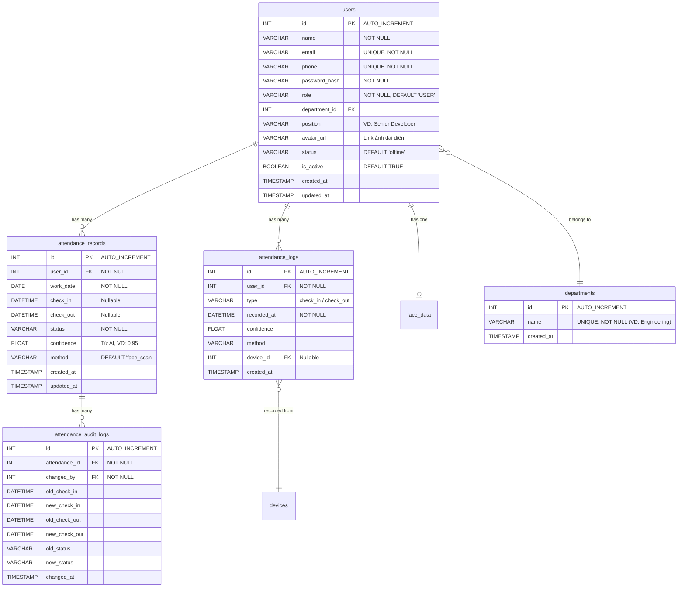

# Database Schema Design - EAMS
*Tài liệu thiết kế cơ sở dữ liệu MySQL cho Employee Attendance Management System.*

---

## Sơ đồ quan hệ tổng quan (ERD)



---

## Chi tiết từng bảng

### 1. `departments` (Phòng ban)
> Tách riêng để chuẩn hoá (Normalization) thay vì lưu string trực tiếp trong bảng users.

```sql
CREATE TABLE departments (
    id INT AUTO_INCREMENT PRIMARY KEY,
    name VARCHAR(100) NOT NULL UNIQUE,
    created_at TIMESTAMP DEFAULT CURRENT_TIMESTAMP
);
```

| Column | Type | Constraint | Ghi chú |
|---|---|---|---|
| `id` | INT | PK, AUTO_INCREMENT | |
| `name` | VARCHAR(100) | UNIQUE, NOT NULL | VD: "Engineering", "Product", "HR" |
| `created_at` | TIMESTAMP | DEFAULT CURRENT_TIMESTAMP | |

**Dữ liệu seed ban đầu** (dựa trên mock-data Frontend):
- Engineering, Product, Design, Human Resources, Analytics, Marketing

---

### 2. `users` (Người dùng / Nhân viên)
> Bảng trung tâm của hệ thống. Phục vụ cả Employee lẫn Admin.

```sql
CREATE TABLE users (
    id INT AUTO_INCREMENT PRIMARY KEY,
    name VARCHAR(255) NOT NULL,
    email VARCHAR(255) NOT NULL UNIQUE,
    phone VARCHAR(20) NOT NULL UNIQUE,
    password_hash VARCHAR(255) NOT NULL,

    role VARCHAR(50) NOT NULL DEFAULT 'USER',

    department_id INT,
    position VARCHAR(150),
    avatar_url VARCHAR(500),

    status VARCHAR(50) DEFAULT 'offline',

    is_active BOOLEAN DEFAULT TRUE,

    created_at TIMESTAMP DEFAULT CURRENT_TIMESTAMP,
    updated_at TIMESTAMP DEFAULT CURRENT_TIMESTAMP ON UPDATE CURRENT_TIMESTAMP,

    FOREIGN KEY (department_id)
        REFERENCES departments(id)
        ON DELETE SET NULL
);
```

| Column | Type | Constraint | Ghi chú |
|---|---|---|---|
| `id` | INT | PK, AUTO_INCREMENT | |
| `name` | VARCHAR(255) | NOT NULL | Họ tên đầy đủ |
| `email` | VARCHAR(255) | UNIQUE, NOT NULL | Dùng để login |
| `phone` | VARCHAR(20) | UNIQUE, NOT NULL | Số điện thoại |
| `password_hash` | VARCHAR(255) | NOT NULL | Bcrypt hash, **không lưu plaintext** |
| `role` | VARCHAR(50) | NOT NULL, DEFAULT 'USER' | Phân quyền (USER, ADMIN, ...) |
| `department_id` | INT | FK -> departments(id), ON DELETE SET NULL | Nullable cho Admin nếu cần |
| `position` | VARCHAR(150) | | VD: "Senior Developer", "Tech Lead" |
| `avatar_url` | VARCHAR(500) | | URL ảnh đại diện |
| `status` | VARCHAR(50) | DEFAULT 'offline' | Trạng thái hoạt động |
| `is_active` | BOOLEAN | DEFAULT TRUE | `FALSE` = soft deleted |
| `created_at` | TIMESTAMP | DEFAULT CURRENT_TIMESTAMP | |
| `updated_at` | TIMESTAMP | ON UPDATE CURRENT_TIMESTAMP | |

**Indexes:**
- `UNIQUE INDEX (email)` — auto from UNIQUE constraint
- `UNIQUE INDEX (phone)` — auto from UNIQUE constraint
- `INDEX idx_user_department (department_id)`
- `INDEX idx_user_role (role)`

**Lý do thiết kế:**
- `role` dùng VARCHAR thay vì ENUM để linh hoạt mở rộng thêm vai trò mới mà không cần ALTER TABLE.
- `phone` thêm field mới, UNIQUE để hỗ trợ xác minh danh tính.
- `is_active` thay vì xóa cứng để giữ toàn vẹn dữ liệu tham chiếu (FK từ attendance).
- `department_id` ON DELETE SET NULL — khi xóa phòng ban, user vẫn tồn tại.

---

### 3. `face_data` (Dữ liệu khuôn mặt)
> Metadata khuôn mặt trên MySQL. Vector embeddings thực tế được lưu ở AI Service/Vector DB.

```sql
CREATE TABLE face_data (
    id INT AUTO_INCREMENT PRIMARY KEY,
    user_id INT NOT NULL UNIQUE,

    image_path VARCHAR(500),
    embedding_ref TEXT,

    registered_at TIMESTAMP NULL,
    updated_at TIMESTAMP DEFAULT CURRENT_TIMESTAMP ON UPDATE CURRENT_TIMESTAMP,

    FOREIGN KEY (user_id)
        REFERENCES users(id)
        ON DELETE CASCADE
);
```

| Column | Type | Constraint | Ghi chú |
|---|---|---|---|
| `id` | INT | PK, AUTO_INCREMENT | |
| `user_id` | INT | FK -> users(id), UNIQUE, ON DELETE CASCADE | Mỗi user chỉ 1 bộ face data |
| `image_path` | VARCHAR(500) | Nullable | Đường dẫn ảnh gốc đã upload |
| `embedding_ref` | TEXT | Nullable | ID tham chiếu đến vector trong AI/Python Service |
| `registered_at` | TIMESTAMP | Nullable | Thời điểm đăng ký face data |
| `updated_at` | TIMESTAMP | ON UPDATE CURRENT_TIMESTAMP | |

**Lý do thiết kế:**
- `embedding_ref` chứa key/ID để Backend gọi sang AI Service khi verify face.
- Tách riêng khỏi bảng `users` theo nguyên tắc Single Responsibility (không phải user nào cũng có face data).
- ON DELETE CASCADE — xóa user thì xóa face data theo.

---

### 4. `attendance_records` (Daily Summary — Bản ghi chấm công theo ngày)
> Mỗi row = 1 ngày làm việc của 1 nhân viên. Mỗi user chỉ có tối đa 1 record/ngày.

```sql
CREATE TABLE attendance_records (
    id INT AUTO_INCREMENT PRIMARY KEY,
    user_id INT NOT NULL,

    work_date DATE NOT NULL,

    check_in DATETIME,
    check_out DATETIME,

    status VARCHAR(50) NOT NULL,

    confidence FLOAT,
    method VARCHAR(50) DEFAULT 'face_scan',

    created_at TIMESTAMP DEFAULT CURRENT_TIMESTAMP,
    updated_at TIMESTAMP DEFAULT CURRENT_TIMESTAMP ON UPDATE CURRENT_TIMESTAMP,

    FOREIGN KEY (user_id)
        REFERENCES users(id)
        ON DELETE RESTRICT,

    UNIQUE KEY unique_user_date (user_id, work_date)
);
```

| Column | Type | Constraint | Ghi chú |
|---|---|---|---|
| `id` | INT | PK, AUTO_INCREMENT | |
| `user_id` | INT | FK -> users(id), NOT NULL, ON DELETE RESTRICT | |
| `work_date` | DATE | NOT NULL | Ngày chấm công |
| `check_in` | DATETIME | Nullable | Thời điểm vào (VD: "2026-04-17 08:15:00") |
| `check_out` | DATETIME | Nullable | Thời điểm ra (VD: "2026-04-17 17:30:00") |
| `status` | VARCHAR(50) | NOT NULL | VD: present, late, absent, half-day |
| `confidence` | FLOAT | Nullable | Độ tin cậy AI trả về (0-1) |
| `method` | VARCHAR(50) | DEFAULT 'face_scan' | Phân biệt check-in tự động vs Admin sửa tay |
| `created_at` | TIMESTAMP | DEFAULT CURRENT_TIMESTAMP | |
| `updated_at` | TIMESTAMP | ON UPDATE CURRENT_TIMESTAMP | |

**Indexes:**
- `UNIQUE KEY unique_user_date (user_id, work_date)` — Mỗi nhân viên chỉ 1 record/ngày
- `INDEX idx_attendance_date (work_date)` — Query theo ngày cho Dashboard Admin
- `INDEX idx_attendance_user (user_id)`
- `INDEX idx_attendance_status (status)` — Lọc theo trạng thái

**Lý do thiết kế:**
- `check_in` / `check_out` đổi từ TIME sang DATETIME để lưu đầy đủ timestamp.
- `status` dùng VARCHAR thay vì ENUM để linh hoạt mở rộng.
- `method` cho phép Admin sửa trạng thái thủ công.
- ON DELETE RESTRICT — không cho phép xóa user nếu còn attendance records.

---

### 5. `attendance_logs` (Raw Events — Sự kiện chấm công thô)
> Mỗi lần quét mặt / check-in / check-out tạo 1 raw event log. Dùng để truy vết và debug.

```sql
CREATE TABLE attendance_logs (
    id INT AUTO_INCREMENT PRIMARY KEY,

    user_id INT NOT NULL,

    type VARCHAR(20) NOT NULL, -- check_in / check_out

    recorded_at DATETIME NOT NULL,

    confidence FLOAT,
    method VARCHAR(50),

    device_id INT NULL,

    created_at TIMESTAMP DEFAULT CURRENT_TIMESTAMP,

    FOREIGN KEY (user_id)
        REFERENCES users(id)
        ON DELETE CASCADE
);
```

| Column | Type | Constraint | Ghi chú |
|---|---|---|---|
| `id` | INT | PK, AUTO_INCREMENT | |
| `user_id` | INT | FK -> users(id), NOT NULL, ON DELETE CASCADE | |
| `type` | VARCHAR(20) | NOT NULL | `check_in` hoặc `check_out` |
| `recorded_at` | DATETIME | NOT NULL | Thời điểm ghi nhận sự kiện |
| `confidence` | FLOAT | Nullable | Độ tin cậy AI |
| `method` | VARCHAR(50) | Nullable | Phương thức: face_scan, manual, etc. |
| `device_id` | INT | FK -> devices(id), Nullable | Thiết bị ghi nhận |
| `created_at` | TIMESTAMP | DEFAULT CURRENT_TIMESTAMP | |

**Indexes:**
- `INDEX idx_logs_user (user_id)`
- `INDEX idx_logs_time (recorded_at)`

**Lý do thiết kế:**
- Tách riêng khỏi `attendance_records` để giữ immutable raw events.
- Hỗ trợ nhiều lần scan trong ngày mà không ảnh hưởng daily summary.
- `device_id` cho phép trace thiết bị nào đã ghi nhận sự kiện.

---

### 6. `attendance_audit_logs` (Nhật ký thay đổi chấm công)
> Ghi lại mọi thay đổi Admin thực hiện trên attendance_records. Phục vụ audit trail.

```sql
CREATE TABLE attendance_audit_logs (
    id INT AUTO_INCREMENT PRIMARY KEY,

    attendance_id INT NOT NULL,
    changed_by INT NOT NULL,

    old_check_in DATETIME,
    new_check_in DATETIME,

    old_check_out DATETIME,
    new_check_out DATETIME,

    old_status VARCHAR(50),
    new_status VARCHAR(50),

    changed_at TIMESTAMP DEFAULT CURRENT_TIMESTAMP,

    FOREIGN KEY (attendance_id)
        REFERENCES attendance_records(id)
        ON DELETE CASCADE,

    FOREIGN KEY (changed_by)
        REFERENCES users(id)
        ON DELETE SET NULL
);
```

| Column | Type | Constraint | Ghi chú |
|---|---|---|---|
| `id` | INT | PK, AUTO_INCREMENT | |
| `attendance_id` | INT | FK -> attendance_records(id), NOT NULL, ON DELETE CASCADE | Record bị thay đổi |
| `changed_by` | INT | FK -> users(id), NOT NULL, ON DELETE SET NULL | Admin thực hiện thay đổi |
| `old_check_in` | DATETIME | Nullable | Giá trị check_in trước khi sửa |
| `new_check_in` | DATETIME | Nullable | Giá trị check_in sau khi sửa |
| `old_check_out` | DATETIME | Nullable | Giá trị check_out trước khi sửa |
| `new_check_out` | DATETIME | Nullable | Giá trị check_out sau khi sửa |
| `old_status` | VARCHAR(50) | Nullable | Status trước khi sửa |
| `new_status` | VARCHAR(50) | Nullable | Status sau khi sửa |
| `changed_at` | TIMESTAMP | DEFAULT CURRENT_TIMESTAMP | Thời điểm thay đổi |

**Lý do thiết kế:**
- Audit trail đầy đủ cho mọi thay đổi manual từ Admin.
- Lưu cả old/new values để dễ dàng rollback hoặc review.
- ON DELETE CASCADE — xóa attendance record thì xóa audit logs theo.
- ON DELETE SET NULL cho `changed_by` — giữ lại log ngay cả khi admin bị xóa.

---

### 7. `devices` (Thiết bị — Optional)
> Quản lý danh sách thiết bị chấm công (camera, tablet, v.v.)

```sql
CREATE TABLE devices (
    id INT AUTO_INCREMENT PRIMARY KEY,
    name VARCHAR(100),
    location VARCHAR(255),
    created_at TIMESTAMP DEFAULT CURRENT_TIMESTAMP
);
```

| Column | Type | Constraint | Ghi chú |
|---|---|---|---|
| `id` | INT | PK, AUTO_INCREMENT | |
| `name` | VARCHAR(100) | Nullable | Tên thiết bị (VD: "Camera Lobby 1") |
| `location` | VARCHAR(255) | Nullable | Vị trí đặt thiết bị |
| `created_at` | TIMESTAMP | DEFAULT CURRENT_TIMESTAMP | |

---

## Indexes

```sql
CREATE INDEX idx_user_department ON users(department_id);
CREATE INDEX idx_user_role ON users(role);

CREATE INDEX idx_attendance_date ON attendance_records(work_date);
CREATE INDEX idx_attendance_user ON attendance_records(user_id);
CREATE INDEX idx_attendance_status ON attendance_records(status);

CREATE INDEX idx_logs_user ON attendance_logs(user_id);
CREATE INDEX idx_logs_time ON attendance_logs(recorded_at);
```

---

## Tóm tắt mối quan hệ (Relationships)

| Quan hệ | Loại | Mô tả |
|---|---|---|
| `users` → `departments` | N:1 | Nhiều nhân viên thuộc 1 phòng ban |
| `users` → `attendance_records` | 1:N | 1 user có nhiều bản ghi chấm công |
| `users` → `attendance_logs` | 1:N | 1 user có nhiều raw event logs |
| `users` → `face_data` | 1:1 | 1 user chỉ có 1 bộ dữ liệu khuôn mặt |
| `attendance_records` → `attendance_audit_logs` | 1:N | 1 record có nhiều audit logs |
| `attendance_logs` → `devices` | N:1 | Nhiều logs ghi nhận từ 1 thiết bị |

---

## Lưu ý quan trọng cho Agent khi triển khai

1. **Tạo Migration file SQL** thay vì can thiệp trực tiếp vào DB.
2. **Seed data** cho bảng `departments` và ít nhất 1 tài khoản Admin seed.
3. **Dùng `bcrypt`** để hash password trước khi INSERT vào `users.password_hash`.
4. **Foreign Key ON DELETE rules:**
   - `users.department_id` → `ON DELETE SET NULL` (xóa phòng ban, user vẫn tồn tại)
   - `face_data.user_id` → `ON DELETE CASCADE` (xóa user, xóa face data theo)
   - `attendance_records.user_id` → `ON DELETE RESTRICT` (không xóa user nếu còn attendance)
   - `attendance_logs.user_id` → `ON DELETE CASCADE` (xóa user, xóa logs theo)
   - `attendance_audit_logs.attendance_id` → `ON DELETE CASCADE`
   - `attendance_audit_logs.changed_by` → `ON DELETE SET NULL`
5. **Thứ tự tạo bảng** (do FK dependencies): `departments` → `users` → `face_data` → `devices` → `attendance_records` → `attendance_logs` → `attendance_audit_logs`
