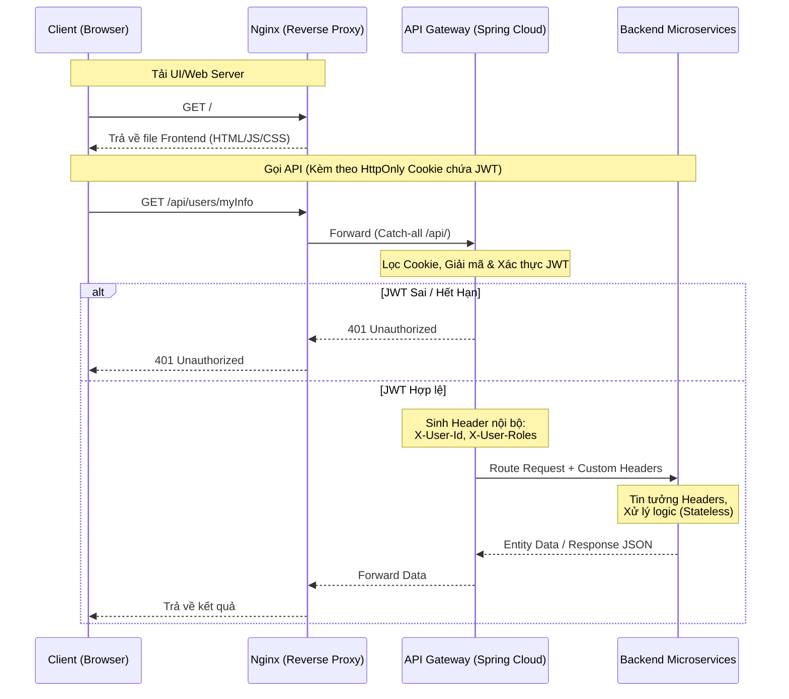

### 3.3. Sơ đồ Data Flow

```mermaid
sequenceDiagram
    participant Client as Client (Browser)
    participant Nginx as Nginx (Reverse Proxy)
    participant Gateway as API Gateway (Spring Cloud)
    participant MS as Backend Microservices

    Note over Client, Nginx: Tải UI/Web Server
    Client->>Nginx: GET /
    Nginx-->>Client: Trả về file Frontend (HTML/JS/CSS)

    Note over Client, MS: Gọi API (Kèm theo HttpOnly Cookie chứa JWT)
    Client->>Nginx: GET /api/users/myInfo
    Nginx->>Gateway: Forward (Catch-all /api/)

    Note over Gateway: Lọc Cookie, Giải mã & Xác thực JWT
    alt JWT Sai / Hết Hạn
        Gateway-->>Nginx: 401 Unauthorized
        Nginx-->>Client: 401 Unauthorized
    else JWT Hợp lệ
        Note over Gateway: Sinh Header nội bộ:<br>X-User-Id, X-User-Roles
        Gateway->>MS: Route Request + Custom Headers
        Note over MS: Tin tưởng Headers,<br/>Xử lý logic (Stateless)
        MS-->>Gateway: Entity Data / Response JSON
        Gateway-->>Nginx: Forward Data
        Nginx-->>Client: Trả về kết quả
    end
```

---