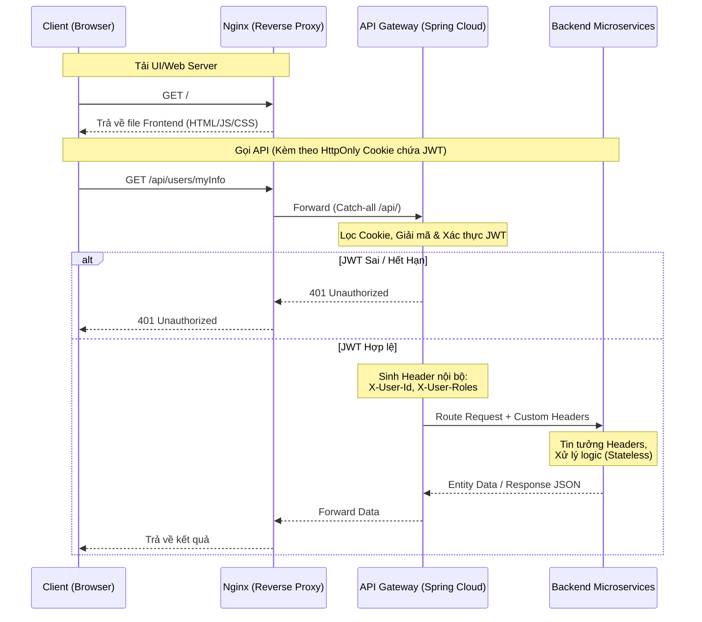

# PROJECT 1 CORE SPECS (Cinema Booking)

## 1. Database Schema (JPA Entities)

### Bảng `User`
- **id** (`String`, UUID, `@Id`)
- **name** (`String`)
- **email** (`String`)
- **password** (`String`)
- **phone** (`String`)
- **role** (`Role`, `@ManyToOne`, join column `role_name`) - Mối quan hệ User (N) - (1) Role

### Bảng `Role`
- **name** (`String`, `@Id`)
- **description** (`String`)
- **permissions** (`Set<Permission>`, `@ManyToMany`) - Mối quan hệ Role (N) - (N) Permission

### Bảng `Permission`
- **name** (`String`, `@Id`)
- **description** (`String`)

### Bảng `InvalidatedToken`
- **id** (`String`, `@Id`)
- **expiryTime** (`Date`)

---

## 2. Security & JWT Logic

### Spring Security Config (`SecurityConfig.java`)
- **Public API:** `POST /auth/login`, `POST /auth/introspect`, `POST /auth/refresh` (và `OPTIONS /**` cho CORS).
- **Protected API:** Các endpoints với path `/users/**`, `/roles/**`, `/permissions/**` yêu cầu có quyền `ROLE_ADMIN`. Các request khác đều cần xác thực (authenticated).
- **CORS & CSRF:** Cho phép preflight bằng `.cors()`, disable CSRF bằng `.csrf(AbstractHttpConfigurer::disable)`.
- **JWT & OAuth2:** 
  - Sử dụng `.oauth2ResourceServer(oauth2 -> oauth2.jwt(...))`
  - Tích hợp `CustomJwtDecoder` để giải mã token.
  - Tích hợp `JwtAuthenticationConverter` để tùy chỉnh prefix của Authorities (bỏ prefix default `SCOPE_`).

### JWT Encoding & Decoding (`AuthenticationServiceImpl.java` & `CustomJwtDecoder.java`)
- **Secret Key:** đọc từ biến môi trường `SIGNED_KEY`; không commit giá trị thật vào source/docs.
- **Thuật toán chữ ký:** HMAC bằng thuật toán thư viện `nimbusds` (`MacAlgorithm.HS512`).
- **Payload (`JWTClaimsSet`):** 
  - `subject`: user email
  - `issuer`: "cinema-booking"
  - `issueTime`: thời điểm tạo
  - `expirationTime`: tính từ thời gian hiện tại cộng với `VALID_DURATION`.
  - `jwtID`: UUID cho token
  - `userId`: id của user
  - `scope`: danh sách các Role (với prefix `ROLE_`) và Permission (tách nhau bằng dấu space). Ví dụ: `ROLE_ADMIN READ_DATA WRITE_DATA`

### Logout & Token Refresh
- Chặn Token đã Log out (Invalidate token) bằng cách lưu lại `jwtID` (`jti`) cùng với `expiryTime` vào bảng `InvalidatedToken`.
- Khi gọi `/auth/introspect` hoặc xác thực qua Security Filter, Token sẽ được kiểm tra xem id đã tồn tại trong `InvalidatedToken` hay chưa.

---

## 3. Kiến trúc Triển khai & Mạng (Deployment & Network Architecture)

Kiến trúc hệ thống hướng tới **Microservices** hoàn toàn, tập trung vào tính hiệu năng và ủy quyền linh hoạt tại tầng Gateway.

### 3.1. Tầng Nginx (Reverse Proxy siêu nhẹ)
- **Routing cơ bản:** Chỉ làm 2 nhiệm vụ định tuyến chính, tối ưu hóa để tải Frontend mượt mà, không gánh logic nghiệp vụ cấu hình tĩnh.
- **Request path `/`:** Định tuyến thẳng toàn bộ traffic về Frontend server (vd: React/Vue/Angular).
- **Request path `/api/`:** Định tuyến toàn bộ (catch-all) về tầng API Gateway phía sau. Nginx tuyệt đối không cấu hình lẻ tẻ cho từng dịch vụ cụ thể (như `/api/auth` hay `/api/users`).

### 3.2. Tầng API Gateway (Spring Cloud Gateway)
- **Centralized Entrypoint:** Đảm nhận việc tiếp nhận mọi requests `/api/**` được đẩy vào từ Nginx.
- **Dynamic Routing:** Tự động điều hướng động đến các Microservices (Auth, Users, Orders...) phía sau.
- **Authentication Lõi (Core Auth Proxy):**
  - Đọc request đến và bóc tách `HttpOnly Cookie` để trích xuất JWT.
  - Kích hoạt cơ chế xác thực (Verify JWT) dựa trên các cơ chế đã thống nhất (HS512).
  - Nếu JWT lệ (Valid): Chặn và bóc tách Payload, chuyển đổi thành HTTP Header nội bộ siêu gọn nhẹ (VD: `X-User-Id`, `X-User-Roles`) để gửi xuống các service nghiệp vụ ở hạ tầng trong (Backend).
  - **Stateless Microservices:** Các service nằm sau Gateway hoàn toàn không cần tự xử lý Token/JWT nữa, mà chỉ cần đọc thông tin ở các HTTP Headers do Gateway đẩy vào.
- **Rate Limiting & Logging:** Thiết lập các cơ chế kiểm soát lưu lượng, chặn spam và theo dõi lịch sử request tập trung.

### 3.3. Sơ đồ Data Flow

---

## 4. API Endpoints

### 4.1 Authentication Controller (`/auth`)
| Method | Endpoint | Request Body | Phân quyền | Mô tả |
| ------ | -------- | ------------ | -----------| ----- |
| POST | `/auth/login` | `AuthenticationRequest` | Public | Xác thực email/password, trả về JWT. |
| POST | `/auth/introspect`| `IntrospectRequest` | Public | Kiểm tra tính hợp lệ của token. |
| POST | `/auth/refresh` | `RefreshRequest` | Public | Refresh token khi hết hạn, vô hiệu hóa token cũ. |
| POST | `/auth/logout` | `LogoutRequest` | - | Đăng xuất (Vô hiệu hóa token). |

### 4.2 User Controller (`/users`)
| Method | Endpoint | Request Body | Phân quyền | Mô tả |
| ------ | -------- | ------------ | -----------| ----- |
| POST | `/users` | `UserRegisterRequest` | Public | Đăng ký người dùng mới. |
| PUT | `/users/{userId}` | `UserUpdateRequest` | `ROLE_ADMIN` | Cập nhật thông tin user. |
| GET | `/users/{userId}` | - | `ROLE_ADMIN` | Lấy chi tiết một user theo `userId`. |
| GET | `/users` | - | `ROLE_ADMIN` | Lấy danh sách toàn bộ user. |
| GET | `/users/myInfo` | - | Authenticated | Lấy thông tin user đang đăng nhập. |

### 4.3 Role Controller (`/roles`)
| Method | Endpoint | Request Body | Phân quyền | Mô tả |
| ------ | -------- | ------------ | -----------| ----- |
| POST | `/roles` | `RoleCreateRequest` | `ROLE_ADMIN` | Tạo mới role. |
| PUT | `/roles/{name}` | `RoleUpdateRequest` | `ROLE_ADMIN` | Cập nhật role. |
| DELETE| `/roles/{role}` | - | `ROLE_ADMIN` | Xóa một role theo `name`. |
| GET | `/roles` | - | `ROLE_ADMIN` | Hiển thị tất cả list roles. |

### 4.4 Permission Controller (`/permissions`)
| Method | Endpoint | Request Body | Phân quyền | Mô tả |
| ------ | -------- | ------------ | -----------| ----- |
| POST | `/permissions` | `PermissionCreateRequest`| `ROLE_ADMIN` | Tạo permission mới. |
| PUT | `/permissions/{name}`| `PermissionUpdateRequest`| `ROLE_ADMIN` | Cập nhật permission. |
| DELETE| `/permissions/{permissionId}` | - | `ROLE_ADMIN` | Xóa một permission theo ID (hoặc tên). |
| GET | `/permissions` | - | `ROLE_ADMIN` | Liệt kê tất cả permissions. |
