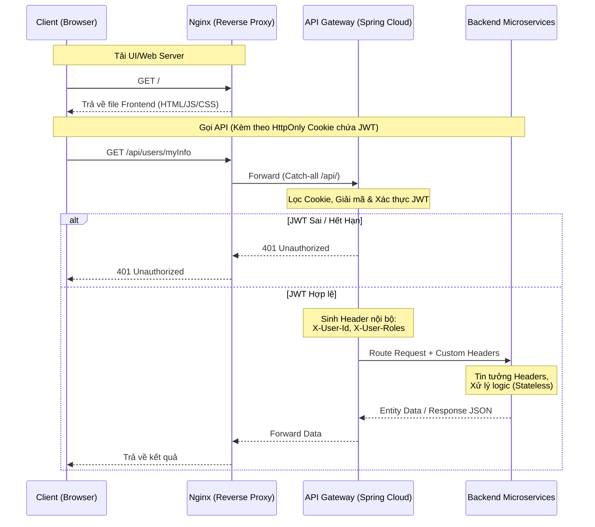

# Kiến trúc Hệ thống chấm công bằng khuôn mặt

## Tổng quan
Hệ thống Quản lý Chấm công bằng khuôn mặt được thiết kế theo kiến trúc **Microservices** dựa trên hệ sinh thái Spring Boot & Spring Cloud. Thay vì kiến trúc nguyên khối (Monolithic), ứng dụng phân tách các domain nghiệp vụ (như Auth, Attendance, Gateway) thành các dịch vụ độc lập. Các dịch vụ này giao tiếp với nhau thông qua Eureka Registry và API Gateway, sử dụng Spring Security và JWT (Stateless) để xác thực và phân quyền.

## 1. Kế hoạch Xây dựng Hệ thống Microservices (Master Plan)

### Giai đoạn 1: Xây dựng Eureka Service (Service Registry)
- Khởi tạo project `eureka-service` với dependency `spring-cloud-starter-netflix-eureka-server`.
- Cấu hình chạy trên port `8761`.
- Đóng vai trò là danh bạ trung tâm. Các service khác khi khởi động sẽ tự động đăng ký (register) với Eureka.

### Giai đoạn 2: Xây dựng API Gateway
- Khởi tạo project `api-gateway` với dependency `spring-cloud-starter-gateway`, `spring-cloud-starter-netflix-eureka-client`.
- Cấu hình port `8080`.
- Cấu hình routing tự động qua Eureka (Sử dụng `lb://auth-service`, `lb://core-service`).
- Xây dựng `JwtAuthenticationFilter` tích hợp Local Verification:
  + Đọc token từ Header/Cookie -> Tự kiểm tra chữ ký (HS512) và thời hạn.
  + Gọi API nội bộ sang Auth Service để kiểm tra Token Blacklist (đã logout chưa).
  + Bóc tách UserId, Roles -> Gắn vào Header `X-User-Id`, `X-User-Roles` rồi Forward xuống backend.
- **Lưu ý quan trọng:** Gateway phải giữ biến môi trường `SIGNED_KEY` (chia sẻ chung với Auth Service) để có thể tự verify chữ ký JWT.

### Giai đoạn 3: Xây dựng Auth Service (Tái cấu trúc từ project cũ)
- Khởi tạo project `auth-service` (Port: `8081` hoặc dynamic). Đăng ký làm Eureka Client.
- Sử dụng cấu hình kết nối DB riêng (`auth_db`).
- Di chuyển toàn bộ các Entities: `User`, `Role`, `Permission`, `InvalidatedToken` từ project cũ sang đây.
- Triển khai API Authentication: `/auth/login`, `/auth/refresh`, `/auth/logout`. Cung cấp thêm endpoint nội bộ `/auth/introspect` hoặc `/auth/check-blacklist` cho Gateway gọi sang.
- **Lưu ý:** Giữ biến môi trường `SIGNED_KEY` để tạo (sign) Token, đồng thời chia sẻ key này cho API Gateway.

### Giai đoạn 4: Xây dựng Core Service (Chấm công & AI)
- Khởi tạo project `core-service` (Port: `8082` hoặc dynamic). Đăng ký làm Eureka Client.
- Sử dụng cấu hình kết nối DB riêng (`core_db`).
- Triển khai các API xử lý `Attendance`, `Employee Data`, `Face Analytics`.
- **Lưu ý:** Hoàn toàn KHÔNG import thư viện JWT, KHÔNG giữ `SIGNED_KEY`. Sử dụng `HttpServletRequest` để đọc Header `X-User-Id`, `X-User-Roles` do Gateway truyền xuống. Tương tác với `auth-service` qua `OpenFeign` (nếu cần truy vấn email/tên chi tiết).

## 2. Security & JWT Logic (Hiện trạng Monolithic gốc cần tái cấu trúc)
*(Lưu ý: Phần logic dưới đây là thiết kế từ kiến trúc nguyên khối cũ để làm tài liệu tham khảo. Quá trình phân bổ lại logic này cho API Gateway và Auth Service trong môi trường Microservices được phân tích chi tiết tại Mục 4).*

### Spring Security Config (`SecurityConfig.java`)
- **Public API:** `POST /auth/login`, `POST /auth/introspect`, `POST /auth/refresh` (và `OPTIONS /**` cho CORS).
- **Protected API:** Các endpoints với path `/users/**`, `/roles/**`, `/permissions/**` yêu cầu có quyền `ROLE_ADMIN`. Các request khác đều cần xác thực (authenticated).
- **CORS & CSRF:** Cho phép preflight bằng `.cors()`, disable CSRF bằng `.csrf(AbstractHttpConfigurer::disable)`.
- **JWT & OAuth2:** 
  - Sử dụng `.oauth2ResourceServer(oauth2 -> oauth2.jwt(...))`
  - Tích hợp `CustomJwtDecoder` để giải mã token.
  - Tích hợp `JwtAuthenticationConverter` để tùy chỉnh prefix của Authorities (bỏ prefix default `SCOPE_`).

### JWT Encoding & Decoding (`AuthenticationServiceImpl.java` & `CustomJwtDecoder.java`)
- **Secret Key:** `SIGNED_KEY = "0e796109b182226d16e5ba239be1c9ce38c78d378444b4b8e2058e914ff887b8"` (Đang hardcode cứng).
- **Thuật toán chữ ký:** HMAC bằng thuật toán thư viện `nimbusds` (`MacAlgorithm.HS512`).
- **Payload (`JWTClaimsSet`):** 
  - `subject`: user email
  - `issuer`: "cinema-booking"
  - `issueTime`: thời điểm tạo
  - `expirationTime`: tính từ thời gian hiện tại cộng với `VALID_DURATION`.
  - `jwtID`: UUID cho token
  - `userId`: id của user
  - `scope`: danh sách các Role (với prefix `ROLE_`) và Permission (tách nhau bằng dấu space). Ví dụ: `ROLE_ADMIN READ_DATA WRITE_DATA`

### Logout & Token Refresh
- Chặn Token đã Log out (Invalidate token) bằng cách lưu lại `jwtID` (`jti`) cùng với `expiryTime` vào bảng `InvalidatedToken`.
- Khi gọi `/auth/introspect` hoặc xác thực qua Security Filter, Token sẽ được kiểm tra xem id đã tồn tại trong `InvalidatedToken` hay chưa.

## 3. Kiến trúc Triển khai & Mạng (Deployment & Network Architecture)

Kiến trúc hệ thống hướng tới **Microservices** hoàn toàn, tập trung vào tính hiệu năng và ủy quyền linh hoạt tại tầng Gateway.

### 3.1. Tầng Nginx (Reverse Proxy siêu nhẹ)
- **Routing cơ bản:** Chỉ làm 2 nhiệm vụ định tuyến chính, tối ưu hóa để tải Frontend mượt mà, không gánh logic nghiệp vụ cấu hình tĩnh.
- **Request path `/`:** Định tuyến thẳng toàn bộ traffic về Frontend server (vd: React/Vue/Angular).
- **Request path `/api/`:** Định tuyến toàn bộ (catch-all) về tầng API Gateway phía sau. Nginx tuyệt đối không cấu hình lẻ tẻ cho từng dịch vụ cụ thể (như `/api/auth` hay `/api/users`).

### 3.2. Tầng API Gateway (Spring Cloud Gateway)
- **Centralized Entrypoint:** Đảm nhận việc tiếp nhận mọi requests `/api/**` được đẩy vào từ Nginx.
- **Dynamic Routing:** Tự động điều hướng động đến các Microservices (Auth, Users, Orders...) phía sau.
- **Authentication Lõi (Core Auth Proxy):**
  - Đọc request đến và bóc tách `HttpOnly Cookie` để trích xuất JWT.
  - Kích hoạt cơ chế xác thực (Verify JWT) dựa trên các cơ chế đã thống nhất (HS512).
  - Nếu JWT lệ (Valid): Chặn và bóc tách Payload, chuyển đổi thành HTTP Header nội bộ siêu gọn nhẹ (VD: `X-User-Id`, `X-User-Roles`) để gửi xuống các service nghiệp vụ ở hạ tầng trong (Backend).
  - **Stateless Microservices:** Các service nằm sau Gateway hoàn toàn không cần tự xử lý Token/JWT nữa, mà chỉ cần đọc thông tin ở các HTTP Headers do Gateway đẩy vào.
- **Rate Limiting & Logging:** Thiết lập các cơ chế kiểm soát lưu lượng, chặn spam và theo dõi lịch sử request tập trung.

### 3.3. Sơ đồ Data Flow

---

## 4. Phân tích Xung đột Kiến trúc cũ & Giải pháp (Conflict Analysis)

Khi chuyển đổi từ khối kiến trúc Monolithic (ở Phần 2) sang Microservices, phần logic bảo mật (Security JWT) đang có một số điểm xung đột với nguyên tắc Microservices và Gateway. Dưới đây là các xung đột và phương án xử lý đã được thống nhất:

### Xung đột 1: Vị trí xác thực JWT (JWT Validation Location)
- **Hiện trạng (Phần 2):** Lớp `CustomJwtDecoder` và filter của Spring Security nằm trực tiếp bên trong logic của các Controller xử lý nghiệp vụ.
- **Vấn đề:** Nếu đưa vào Microservices, `core-service` không được phép tự check JWT nữa. Đồng thời, việc chia sẻ khóa bí mật sinh token (HS512) cần được quản lý chặt.
- **Phương án xử lý:** 
  - **Dịch chuyển Filter:** Đưa toàn bộ logic kiểm tra chữ ký (Signature HMAC HS512) và thời hạn (Expiration) lên `JwtAuthenticationFilter` ở tầng **API Gateway**. Do dùng mã hóa đối xứng (HS512), **Gateway và Auth Service sẽ dùng chung cấu hình `SIGNED_KEY`**.
  - **Stateless Backend Service:** `core-service` (và các service nghiệp vụ khác) sẽ tắt cấu hình `oauth2ResourceServer`, không cần biết `SIGNED_KEY` là gì, chỉ tin tưởng tuyệt đối vào Header `X-User-Id`, `X-User-Roles` do API Gateway truyền xuống.

### Xung đột 2: Cơ chế Blacklist Token (Logout/InvalidatedToken)
- **Hiện trạng (Phần 2):** Kiểm tra Token bị log out bằng cách query vào bảng `InvalidatedToken` trong DB.
- **Vấn đề:** Bảng `InvalidatedToken` thuộc về DB `auth_db`. API Gateway không có quyền kết nối trực tiếp vào DB này.
- **Phương án xử lý:** API Gateway xử lý theo 2 bước:
  1. **Local Verification:** Gateway tự verify chữ ký mã hóa JWT bằng `SIGNED_KEY` để lọc nhanh các token giả mạo, hết hạn -> **Không tốn latency mạng**.
  2. **Blacklist Check:** Nếu qua bước 1, Gateway gọi WebClient sang endpoint nội bộ (VD: `/auth/introspect`) của Auth Service để kiểm tra Token ID có nằm trong Blacklist hay không.

### Xung đột 3: Static Routing vs Dynamic Routing
- **Hiện trạng:** Gateway định tuyến tĩnh bằng URL như `http://localhost:8081`.
- **Phương án xử lý:** Tích hợp **Eureka Service Registry**. Các service sẽ không trỏ port cứng cho nhau nữa mà đăng ký với Eureka và gọi qua tên dịch vụ.
